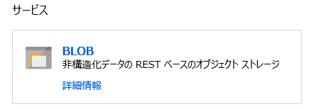

# Serverless Logic Apps Demo Setup

Setup:  Create Azure Storage Account, CosmosDB, Azure Search
This must be completed before giving demo.

## Use template to create Storage, Cosmos DB, and Azure Function

1. Click Deploy to Azure button below.

1. Fill in the values, giving the resource group a name and location, and prefix name for the resource that will be created in it.  1. Select the terms and agreement check box.

    

1. Select purchase.

    

1. When the deployment finishes, we need to verify the Logic App. Click on the "go to resource" button of the deployment notification

    

## Create a Storage Account Container

The storage account will be used to upload a file to start the Logic App.

1. When the deployment finishes, we need to create the blob container in the storage account. Open the storage account created in the deployment.

1. Click the Blobs link in the middle of the screen under Services.

    

1. On the Blob Service page, select "+ Container"

    

1. On the New Container screen, give the container a name and set the access level.  Then press "OK".

    

1. (Optional) It is recommended that you download and install Azure Storage Explorer from [https://azure.microsoft.com/en-us/features/storage-explorer/](https://azure.microsoft.com/en-us/features/storage-explorer/).

    The demo walkthrough does use the Azure Storage Explorer, though the file can be uploaded through the portal.

## Create CosmosDB Collection

Now that we have an storage account let's create an instance of CosmosDB where the messages from the file will be saved.

1. Browse to your resource group and open the Azure Cosmos DB account resource.

1. On the CosmosDB overview page, Click "Add Collection"

    

1. In the blade on the right hand side, give the database a name, the collection a name, and ensure that storage capacity is set to fixed.  Then press "OK".

    

The setup steps are now complete.
