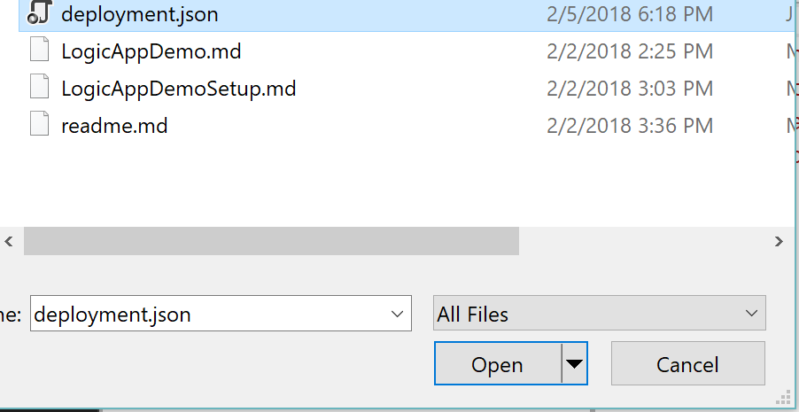
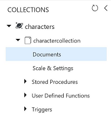
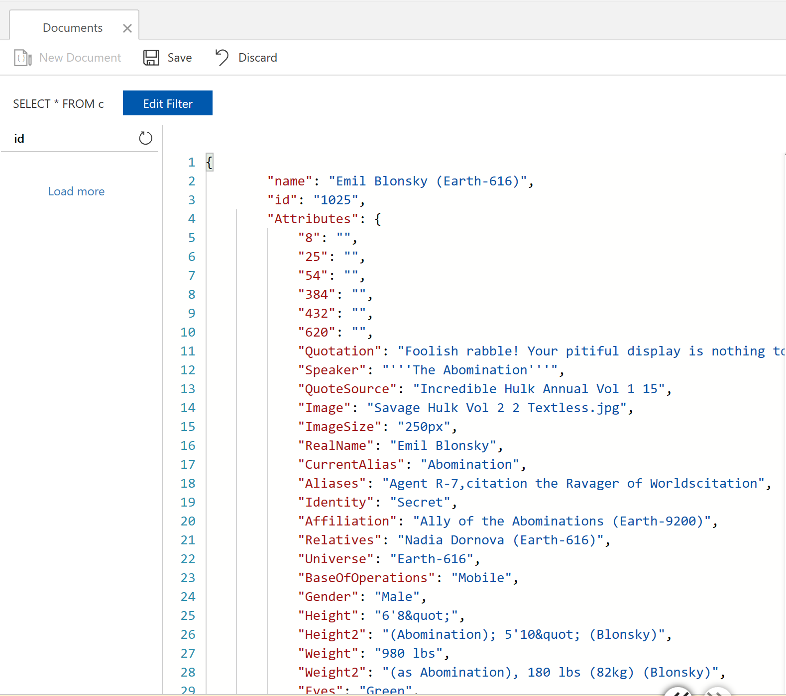
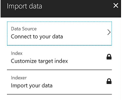
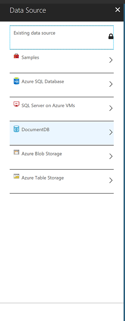
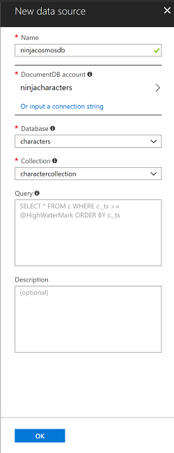
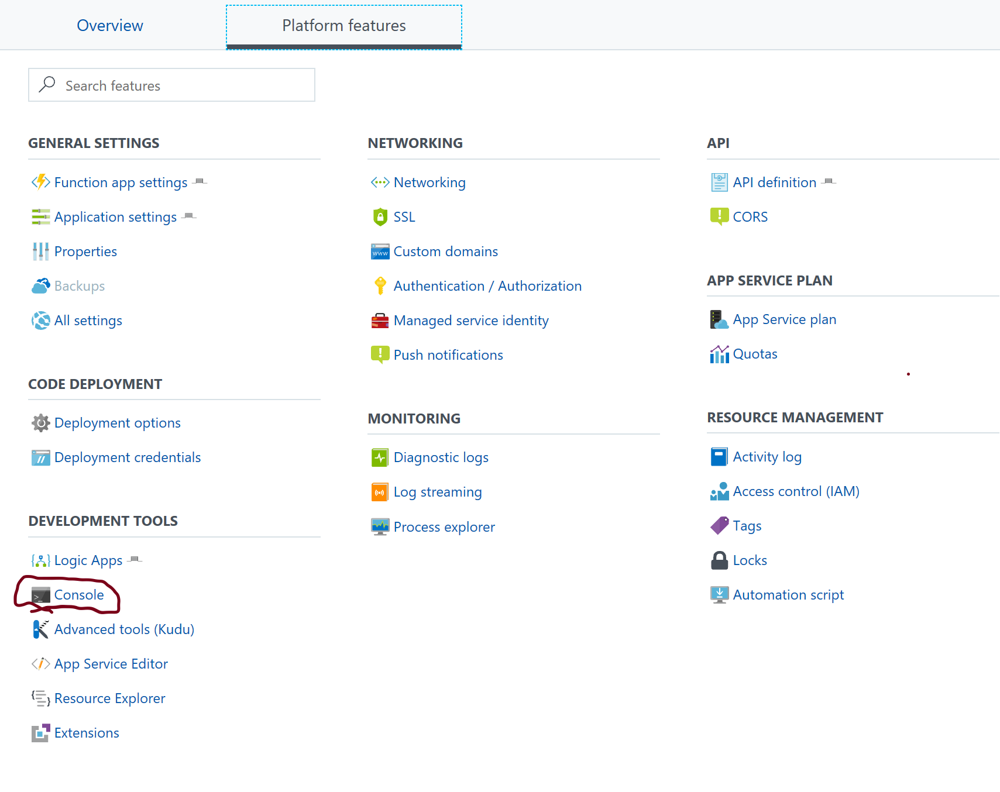
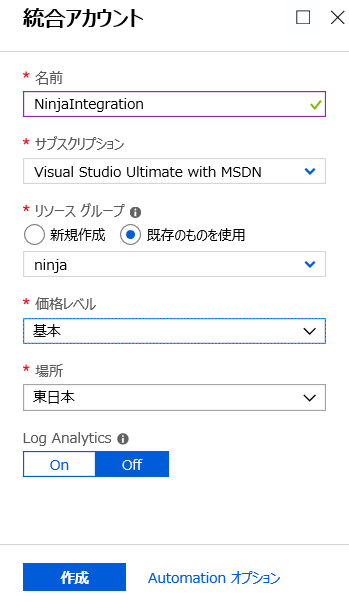

# Serverless Logic Apps Demo Setup

Setup:  Create Azure Storage Account, CosmosDB, Azure Search
This must be completed before giving demo.

## Update Deployment template

1. Open the [template.json](template.json) file in an editor.

1. Search for api-key, and enter the Azure Search primary admin key from the Logic App demo.  Note there are two api-keys.

1. Search for URI and verify the azure search uris for the data source and indexer.

1. Search for the connection string and update the connection string to the CosmoDB connection created in the Logic Apps demo.  Be sure to add the CosmosDB key.

1. Save the template.json file.

## Use template to create Logic App

1. Browse to the azure portal [https://portal.azure.com](https://portal.azure.com)

1. Click the New button

    

1. Type "template" into the search box and select Logic App when it pops up

    

1. On the next blade select Template Deployment

    

1. Then click "Create"

    

1. Select "Build your own template in the editor"

    

1. Click "Load file"

    

1. Open the [deployoment.json](deployment.json) file.

    

1. Press Save.

    

1. Press fill in the values, using the same resource group as the demo.

    

1. Select the terms and agreement check box.

    

1. Select purchase.

    

1. When the deployment finishes, we need to verify the Logic App. Click on the "go to resource" button of the deployment notification

    

## Create a Storage Account Container

The storage account will be used to upload a file to start the Logic App.

1. When the deployment finishes, we need to create the blob container in the storage account. Open the storage account created in the deployment (does not end in azstorage).

1. Click the Blobs link in the middle of the screen under Services.

    

1. On the Blob Service page, select "+ Container"

    

1. On the New Container screen, give the container a name and set the access level.  Then press "OK".

    

1. (Optional) It is recommended that you download and install Azure Storage Explorer from [https://azure.microsoft.com/en-us/features/storage-explorer/](https://azure.microsoft.com/en-us/features/storage-explorer/).

    The demo walkthrough does use the Azure Storage Explorer, though the file can be uploaded through the portal.

## Create CosmosDB

Now that we have an storage account let's create an instance of CosmosDB where the messages from the file will be saved.

1. Browse to your resource group and open the Azure Cosmos DB account resource.

1. On the CosmosDB overview page, Click "Add Collection"

    

1. In the blade on the right hand side, give the database a name, the collection a name, and ensure that storage capacity is set to fixed.  Then press "OK".

    

1. Once the collection is created, a document needs to be added in order to create the index for the Azure Search.  On the Data Explorer page, select the database name->collection name-Documents.

    

1. On the right, select Add Document.

    

1. Copy the code from [setupdata.json](setupdata.json) and paste the json into the editor.  Then press "Save".

    

## Create Azure Search

Azure Search is used to show a business process and another endpoint within the Logic App

1. We need to create the index and data source in the search service.  Browse to your resource group and open the Search service resource.

1. Click the "Import Data" button at the top of the page.

    

1. On the Import Data blade, select Connect to your Data

    

1. On the Data Source blade, select DocumentDB

    

1. On the New Data Source blade, give it a name and select DocumentDB account

    

1. Select your CosmosDB account, then select the database and collection name.

    

1. Enter the following value into the Query box:

    ```SQL
    SELECT c.id, c.name, c.Attributes, c.Attributes.Category, c._ts
    FROM c where c._ts >= @HighWaterMark
    ```

    Then select "Query results by _ts" check box.  The press "OK".

    

1. On the Customer Index blade, give the Index a name, and ensure that the id is selected a a Key.  Select Name and Category as Searchable and <b>Retrievable</b> (not shown below) and press "OK".

    

1. On the Create an Indexer Blade, give the Indexer a name and leave the Schedule to Once.  Press "OK".

    

1. Press "OK" on the Import Data blade.

## Create Function

1. We need to create the function in the function app.  Browse to your resource group and open the App Service resource.

1. Create a new function by clicking on the plus sign next to the functions section on the left

    

1. Then click the link that says "Create this function".

    

1. Copy the code from [attributemapfunction.txt](setup_data/attributemapfunction.txt) into the run.csx editor.  Press Save.

    

The following steps will rename the function.  Not required, but recommended.

1. (Optional) Select the unique name of your function app.

     

1. (Optional) Select "Platform Features", then under Development Tools click Console.

    

1. (Optional) In the Console, type:  rename HttpTriggerCSharp1 \<your name\> where <your name> is the new name of the function.

    

1. (Optional) Close the console and select the Overview tab.  Select "Restart" and select "OK" in the popup window.

    

## Create Integration Account

1. Browse to the azure portal [https://portal.azure.com](https://portal.azure.com)

1. Click the New button

    

1. Type "integration account" into the search box and select Integration when it pops up

    

1. On the next blade select Integration account

    

1. Then click "Create"

    

1. On the next screen select a  name for your Integration Account (confirm with checkmark), again let's use the same existing Resource Group as our Storage Account just to keep everything organized, select a pricing tier and location. Then click "Create"

    

1. When the deployment finishes, we can start writing our function's code. Click on the "go to resource" button of the deployment notification

    

1. When the Integration Account opens, select the Maps tile.

    

1. In the Maps blade, select Add.

    

1. On the next blade, start by changing the Map type to liquid.

    

1. Be sure to create a local copy of the liquid map, [TransformCharacters.liquid](setup_data/TransformCharacters.liquid)

1. Enter a name and browse to the local copy of the TransformCharacters.liquid file.  The press OK.

    

The setup steps are now complete.